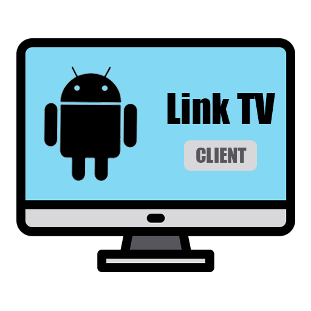
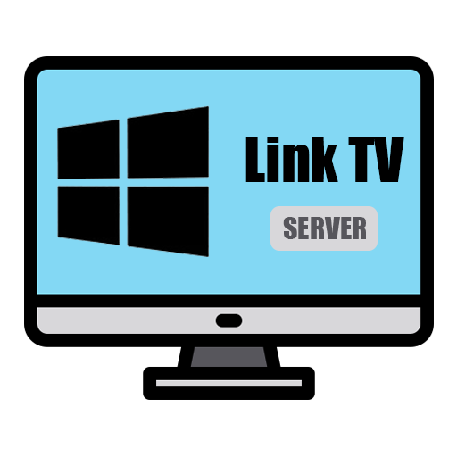

# Link TV

> Flutter Link TV Project.

&emsp;&emsp;*Base LOGO By [`Flaticon License`](https://www.flaticon.com/free-icon/monitor_3474362)*

## 1 Supports

### 1.1 Client

|Android|
|:---:|
||

### 1.2 Desktop

|Windows|MacOS|Linux|
|:---:|:---:|:---:|
||||
